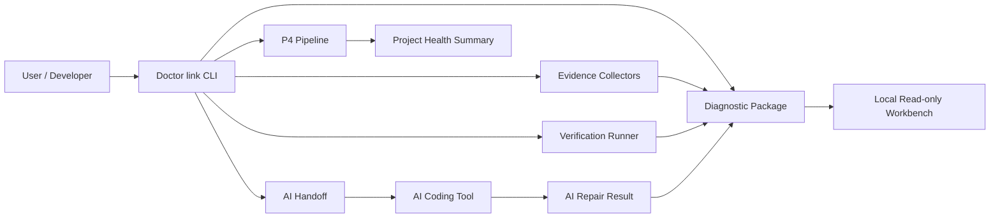

# Architecture Overview

Doctor link is organized as a local diagnostic pipeline.

## Layers

1. CLI entry layer.
2. Evidence and package generation layer.
3. AI Coding collaboration layer.
4. Automated diagnosis pipeline layer.
5. Local read-only workbench layer.

## Boundary

Doctor link is local-first. Cloud sync, external accounts, paid services, and release publishing are outside the default architecture.
